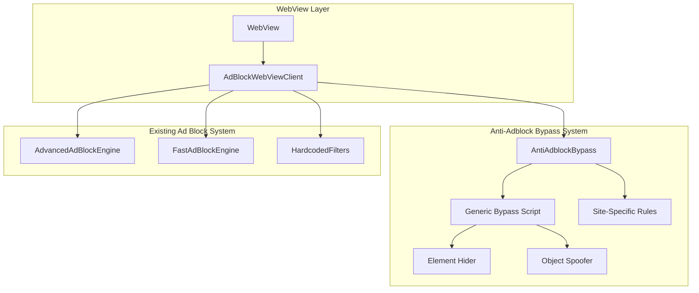

# Anti-Adblock Bypass System Design

## Overview

The Anti-Adblock Bypass System is a JavaScript injection mechanism that neutralizes anti-adblock detection scripts on websites. It works by:

1. **Early Injection**: Injecting bypass JavaScript at `onPageStarted` before anti-adblock scripts execute
2. **Object Spoofing**: Creating fake ad-related JavaScript objects (googletag, adsbygoogle, etc.)
3. **Bait Preservation**: Preventing removal of bait elements that detection scripts check
4. **Element Hiding**: Using CSS and MutationObserver to hide anti-adblock warning elements
5. **Script Neutralization**: Overriding detection functions to return "no ad blocker" results

The system integrates with the existing `AdBlockWebViewClient` and uses the WebView's `evaluateJavascript` method for injection.

## Architecture



## Components and Interfaces

### 1. AntiAdblockBypass (Kotlin Class)

Main coordinator class that manages bypass script injection.

```kotlin
@Singleton
class AntiAdblockBypass @Inject constructor(
    @ApplicationContext private val context: Context
) {
    // Get the appropriate bypass script for a URL
    fun getBypassScript(url: String): String
    
    // Check if bypass should be applied for this URL
    fun shouldApplyBypass(url: String): Boolean
    
    // Get site-specific rules if available
    fun getSiteSpecificRules(domain: String): String?
    
    // Add/remove sites from exclusion list
    fun addToExclusionList(domain: String)
    fun removeFromExclusionList(domain: String)
    fun isExcluded(domain: String): Boolean
}
```

### 2. AntiAdblockScripts (Kotlin Object)

Contains all JavaScript code for anti-adblock bypass.

```kotlin
object AntiAdblockScripts {
    // Generic bypass script applied to all sites
    val genericBypassScript: String
    
    // Site-specific bypass rules
    val siteSpecificRules: Map<String, String>
    
    // Element hiding CSS selectors
    val elementHidingSelectors: List<String>
    
    // Ad object spoofing script
    val objectSpoofingScript: String
    
    // Bait element preservation script
    val baitPreservationScript: String
    
    // MutationObserver script for dynamic element hiding
    val mutationObserverScript: String
}
```

### 3. Integration with AdBlockWebViewClient

The bypass system integrates at two points:

1. **onPageStarted**: Inject early bypass script (object spoofing, bait preservation)
2. **onPageFinished**: Inject element hiding and cleanup scripts

```kotlin
// In AdBlockWebViewClient
override fun onPageStarted(view: WebView?, url: String?, favicon: Bitmap?) {
    super.onPageStarted(view, url, favicon)
    
    // Inject early bypass script
    if (antiAdblockBypass.shouldApplyBypass(url)) {
        val script = antiAdblockBypass.getBypassScript(url)
        view?.evaluateJavascript(script, null)
    }
}

override fun onPageFinished(view: WebView?, url: String?) {
    super.onPageFinished(view, url)
    
    // Inject element hiding script
    if (antiAdblockBypass.shouldApplyBypass(url)) {
        view?.evaluateJavascript(AntiAdblockScripts.elementHidingScript, null)
    }
}
```

## Data Models

### Bypass Rule Configuration

```kotlin
data class BypassRule(
    val domain: String,           // Domain pattern (e.g., "fmovies.*")
    val script: String,           // JavaScript to inject
    val injectAt: InjectTiming,   // EARLY or LATE
    val priority: Int = 0         // Higher priority rules applied first
)

enum class InjectTiming {
    EARLY,  // onPageStarted - before page scripts run
    LATE    // onPageFinished - after page loads
}
```

### Exclusion List

```kotlin
// Stored in DataStore preferences
data class BypassExclusions(
    val excludedDomains: Set<String> = emptySet()
)
```

## Correctness Properties

*A property is a characteristic or behavior that should hold true across all valid executions of a system-essentially, a formal statement about what the system should do. Properties serve as the bridge between human-readable specifications and machine-verifiable correctness guarantees.*

### Property 1: Bypass Script Injection Completeness
*For any* URL where `shouldApplyBypass` returns true, calling `getBypassScript` SHALL return a non-empty JavaScript string containing at minimum the object spoofing code and bait preservation code.
**Validates: Requirements 1.1, 1.3**

### Property 2: Exclusion List Round-Trip Consistency
*For any* domain string, adding it to the exclusion list via `addToExclusionList` and then calling `isExcluded` SHALL return true, and after calling `removeFromExclusionList` with the same domain, `isExcluded` SHALL return false.
**Validates: Requirements 6.1, 6.2, 6.3**

### Property 3: Site-Specific Rule Inclusion
*For any* domain that exists in the site-specific rules map, calling `getBypassScript` with a URL containing that domain SHALL return a script that includes both the generic bypass script AND the site-specific script.
**Validates: Requirements 2.1**

### Property 4: Generic Bypass Fallback
*For any* domain that does NOT exist in the site-specific rules map and is NOT in the exclusion list, calling `getBypassScript` SHALL return the generic bypass script.
**Validates: Requirements 2.2**

### Property 5: Element Hiding Selector Validity
*For any* CSS selector in the element hiding selectors list, the selector SHALL be valid CSS syntax (parseable without throwing a syntax error).
**Validates: Requirements 1.2, 3.2**

### Property 6: Spoofed Objects Completeness
*For any* bypass script returned by `getBypassScript`, the script SHALL define all required ad objects: `googletag`, `adsbygoogle`, `__ads`, and `fuckAdBlock`.
**Validates: Requirements 1.3, 3.1**

### Property 7: JavaScript Try-Catch Wrapping
*For any* bypass script returned by `getBypassScript`, the main execution code SHALL be wrapped in a try-catch block to prevent errors from breaking page functionality.
**Validates: Requirements 3.4**

## Error Handling

### JavaScript Injection Errors
- Wrap all injected JavaScript in try-catch blocks
- Log errors to Android Logcat for debugging
- Continue page load even if injection fails

### Invalid URL Handling
- Return empty script for null/invalid URLs
- Default to generic bypass for unparseable domains

### Exclusion List Persistence Errors
- Use in-memory fallback if DataStore fails
- Log persistence errors but don't crash

## Testing Strategy

### Dual Testing Approach

The system uses both unit tests and property-based tests:

1. **Unit Tests**: Verify specific examples and edge cases
2. **Property-Based Tests**: Verify universal properties across all inputs

### Property-Based Testing Framework

Use **Kotest** with its property-based testing module for Kotlin:
- `io.kotest:kotest-property:5.8.0`
- Minimum 100 iterations per property test
- Tag each test with: `**Feature: anti-adblock-bypass, Property {number}: {property_text}**`

### Unit Testing Requirements

- Test bypass script generation for known domains
- Test exclusion list add/remove operations
- Test JavaScript syntax validity
- Test integration with AdBlockWebViewClient

### Integration Testing

- Test bypass effectiveness on real streaming sites
- Test that legitimate site functionality is preserved
- Test performance impact on page load times

### Test Files

- `app/src/test/java/com/entertainmentbrowser/util/adblock/AntiAdblockBypassTest.kt`
- `app/src/test/java/com/entertainmentbrowser/util/adblock/AntiAdblockScriptsTest.kt`
- `app/src/androidTest/java/com/entertainmentbrowser/util/adblock/AntiAdblockIntegrationTest.kt`
